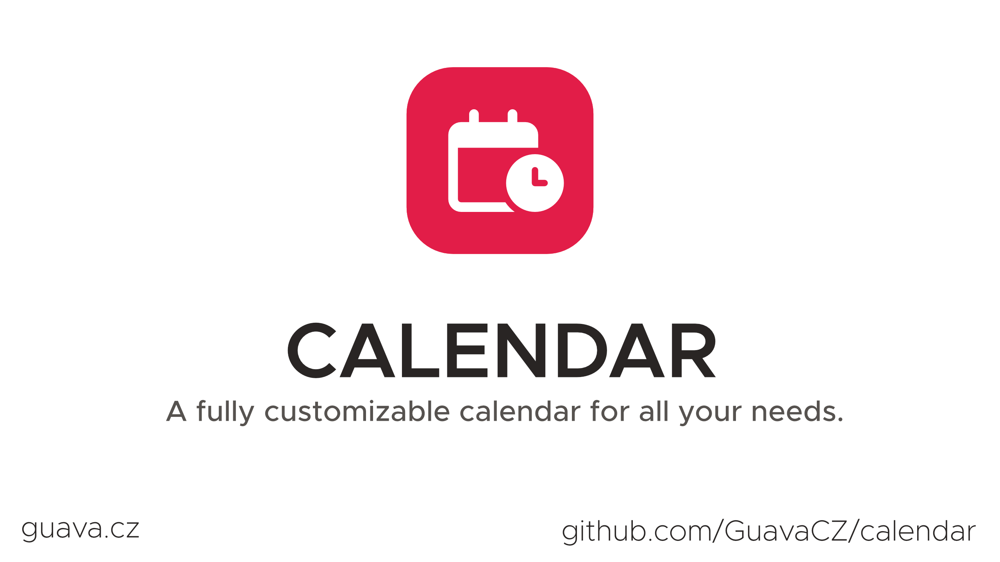

# Adds support for vkurko/calendar to Filament PHP.

[](https://packagist.org/packages/guava/calendar)
[](https://github.com/guava/calendar/actions?query=workflow%3Arun-tests+branch%3Amain)
[](https://github.com/guava/calendar/actions?query=workflow%3A"Fix+PHP+code+style+issues"+branch%3Amain)
[](https://packagist.org/packages/guava/calendar)

This is where your description should go. Limit it to a paragraph or two. Consider adding a small example.

## Showcase

This is where your screenshots and videos should go. Remember to add them, so people see what your plugin does.

## Support us

Your support is key to the continual advancement of our plugin. We appreciate every user who has contributed to our journey so far.

While our plugin is available for all to use, if you are utilizing it for commercial purposes and believe it adds significant value to your business, we kindly ask you to consider supporting us through GitHub Sponsors. This sponsorship will assist us in continuous development and maintenance to keep our plugin robust and up-to-date. Any amount you contribute will greatly help towards reaching our goals. Join us in making this plugin even better and driving further innovation.

## Installation

You can install the package via composer:

```bash
composer require guava/calendar
```

You can publish and run the migrations with:

```bash
php artisan vendor:publish --tag="calendar-migrations"
php artisan migrate
```

You can publish the config file with:

```bash
php artisan vendor:publish --tag="calendar-config"
```

This is the contents of the published config file:

```php
return [
];
```

Optionally, you can publish the views using

```bash
php artisan vendor:publish --tag="calendar-views"
```

## Usage

```php
$calendar = new Guava\Calendar();
echo $calendar->echoPhrase('Hello, Guava!');
```

## Custom Event Content
By default, we use the default view from the calendar package. However, you are able to use your own by overriding the `getEventContent` method on the your calendar widget class.

Due to the nature of the calendar package, it currently is not possible to pass blade parameters to the view. However, each view is wrapped in an alpine component, which has access to the event data. You can use any alpine functionality to display the data any way you seem fit.


## Testing

```bash
composer test
```

## Changelog

Please see [CHANGELOG](CHANGELOG.md) for more information on what has changed recently.

## Contributing

Please see [CONTRIBUTING](CONTRIBUTING.md) for details.

## Security Vulnerabilities

Please review [our security policy](../../security/policy) on how to report security vulnerabilities.

## Credits

- [Lukas Frey](https://github.com/GuavaCZ)
- [All Contributors](../../contributors)
- Spatie - Our package calendar is a modified version of [Spatie's Package Calendar](https://github.com/spatie/package-calendar-laravel)

## License

The MIT License (MIT). Please see [License File](LICENSE.md) for more information.
